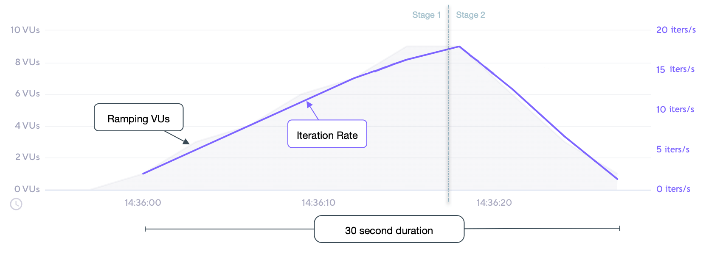

# Performance Testing - Examples

## Antipattern 1: Ignoring Think Time

Not including think time between user actions can lead to unrealistic performance metrics. In this example, the user actions are executed without any delay, which is unrealistic.

```javascript
export default function () {
  http.get('http://example.com/api/resource1');
  http.get('http://example.com/api/resource2');
  http.get('http://example.com/api/resource3');
}
```

### Solution

Introduce think time between user actions to simulate real user behavior. This example adds a random delay between 1 to 5 seconds between each request. The bigger the range, the more realistic the simulation.

```javascript
import { randomIntBetween } from 'https://jslib.k6.io/k6-utils/1.4.0/index.js';
import { sleep } from 'k6';

export default function () {
  http.get('http://example.com/api/resource1');
  sleep(randomIntBetween(1, 5));
  http.get('http://example.com/api/resource2');
  sleep(randomIntBetween(1, 5));
  http.get('http://example.com/api/resource3');
}
```

## Antipattern 2: Lack of Data Variation

Using static, hardcoded data for requests can cause caching mechanisms to produce artificially high performance metrics. In this example, the same username is used for every request, which may not represent real-world scenarios.

```javascript
export default function () {
  const payload = JSON.stringify({
    username: 'username', // Static username used in every request
    password: 'password',
  });

  http.post('http://example.com/api/login', payload);
}
```

### Solution

Use dynamic data or randomization to simulate different user scenarios. This example generates a random username for each request.

```javascript
import exec from 'k6/execution';

export default function () {
  const payload = JSON.stringify({
    username: `username${exec.vu.idInTest}`, // Unique identifier for each virtual user, we will use it to be sure every username is unique
    password: 'password',
  });

  http.post('http://example.com/api/login', payload);
}
```

## Antipattern 3: Not Scaling Virtual Users

Running performance tests with unrealistic numbers of virtual users or ramping up too quickly can lead to inaccurate results. In this example, the test starts with 1000 VUs immediately.

```javascript
export const options = {
  vus: 1000,
  duration: '1m',
};

export default function () {
  http.get('http://example.com/api/resource');
}
```

### Solution

Executors control how k6 schedules VUs and iterations. The executor that you choose depends on the goals of your test and the type of traffic you want to model. For example, the `ramping-vus` executor gradually increases the number of VUs over a specified duration, allowing for more realistic load testing for specific test types.

```javascript
export const options = {
  discardResponseBodies: true,
  scenarios: {
    contacts: {
      executor: 'ramping-vus',
      startVUs: 0,
      stages: [
        { duration: '20s', target: 10 },
        { duration: '10s', target: 0 },
      ],
      gracefulRampDown: '0s',
    },
  },
};

export default function () {
  http.get('http://example.com/api/resource');
  // Injecting sleep
  // Sleep time is 500ms. Total iteration time is sleep + time to finish request.
  sleep(0.5);
}
```

Based upon our test scenario inputs and results:

- The configuration defines 2 stages for a total test duration of 30 seconds;
- Stage 1 ramps up VUs linearly from the startVUs of 0 to the target of 10 over a 20 second duration;
- From the 10 VUs at the end of stage 1, stage 2 then ramps down VUs linearly to the target of 0 over a 10 second duration;
- Each iteration of the default function is expected to be roughly 515ms, or ~2/s;
- As the number of VUs changes, the iteration rate directly correlates; each addition of a VU increases the rate by about 2 iters/s, whereas each subtraction of a VU reduces by about 2 iters/s;
- The example performed ~300 iterations over the course of the test.

#### Chart representation of the test execution


