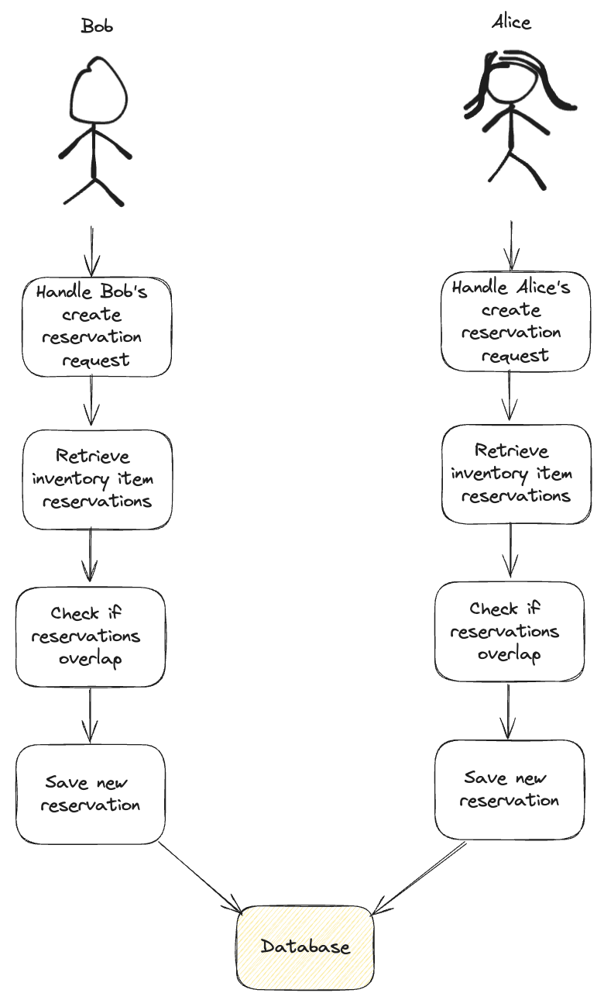

# Handling concurrency using optimistic or pessimistic locking

Concurrency issues arise when multiple entities, such as services, threads, or users, access or modify the same resource simultaneously, leading to race conditions.



Race conditions are very hard to track and debug.
Typically, we develop sequential applications where concurrency concerns are minimal.
Concurrency is a key factor in boosting performance; it is utilized to increase throughput or reduce execution times, and is likely unnecessary in the absence of specific performance requirements.
However, concurrency issues can also occur from parallel requests to the same resources.
For instance, when two users try to reserve the same inventory item at the same time, it highlights a scenario where concurrency management becomes crucial, regardless of performance considerations.

Addressing concurrency within a monolithic architecture differs significantly from managing it in distributed systems. In this article, we will concentrate on strategies for handling concurrency in monolithic applications, reflecting a more common scenario within our company.

There are multiple approaches to managing concurrency, including database isolation levels and design-centric solutions like end-to-end partitioning. In this article, we will specifically explore the concepts of optimistic and pessimistic locking.

We'll also explore practical example of optimistic locking. Let's dive into it!

## Pesimisstic locking vs Optimistic locking


The concepts of pessimistic versus optimistic locking can be metaphorically compared to asking for permission versus apologizing afterward. In pessimistic locking, a lock is placed on the resource, requiring all consumers to ASK for permission before they can modify it. On the other hand, optimistic locking does not involve placing a lock. Instead, consumers proceed under the assumption that they are the sole users of the resource and APOLOGIZE in case of conflict.

In the pessimistic lock approach, actual locks are used on the database level, while in the optimistic approach, no locks are used, resulting in higher throughput.

Optimistic locking, generally speaking, is easier to implement and offers performance benefits but can become costly in scenarios where the chance of conflict is high.
As the probability of conflict increases, the chances of transaction abortion also rise. Rollbacks can be costly for the system as it needs to revert all current pending changes which might involve both table rows and index records.

In situations with a high risk of conflict, it might be better to use pessimistic locking in the first place rather than doing rollbacks and subsequent retries, which can put additional load on the system.
However, pessimistic locking can affect the performance and scalability of your application by maintaining locks on database rows or tables and may also lead to deadlocks if not managed carefully.

**Steps for Implementing Pessimistic Locking:**

1. Retrieve and lock the resource from the database (using "SELECT FOR UPDATE")
2. Apply the necessary changes
3. Save the changes by committing the transaction, which also releases the locks.

**Steps for Implementing Optimistic Locking:**


1. Retrieve the resource from the database
2. Apply the necessary changes
3. Save the changes to the database; an error is thrown in case of a version mismatch, otherwise, the version is incremented

## Example

Let's see optimistic locking in action.
We'll illustrate its application through an example where users can reserve inventory items for a specified period.
Although I'm utilizing MikroORM and PostgreSQL for this demonstration, it's worth noting that optimistic locking can be implemented with nearly any database.

Potentially, we could encounter a scenario where users attempt to reserve the same inventory item simultaneously for overlapping time periods, which could lead to issues.

I would say that the majority of the work here lies in the aggregate design.
I've structured it so that the `InventoryItem` entity acts as the aggregate root, containing `Reservations`. This design mandates that the creation of reservations must proceed through the `InventoryItem` aggregate root, which encapsulates this specific logic.
Upon retrieving an inventory item from the database, it will include all current reservations for that item, enabling us to apply business logic to determine if there is any overlapping reservation that conflicts with the one we intend to create.
If there is no conflict, we proceed with the creation. This method centralizes the reservation creation logic, thereby ensuring consistency.

For optimistic locking, we need a field to determine if an entity has changed since we retrieved it from the database. I used an integer `version` field that increments with each modification.

Here is the code for the `InventoryItem` aggregate root:

```ts
// inventory-item.entity.ts
@Entity()
export class InventoryItem extends AggregateRoot {
  @Property({ version: true })
  readonly version: number = 1;

  @OneToMany({
    entity: () => Reservation,
    mappedBy: (it) => it.reservationItem,
    orphanRemoval: true,
    eager: true,
  })
  private _reservations = new Collection<Reservation>(this);

  createReservation(startDate: Date, endDate: Date, userId: number) {
    const overlapingReservation =
      this.reservations.some(/** Find overlaping reservation logic */);
    if (overlapingReservation) {
      throw new ReservationOverlapException();
    }
    const reservation = new Reservation(this, startDate, endDate, userId);
    this._reservations.add(reservation);
    this.updatedAt = new Date();
  }

  get reservations() {
    return this._reservations.getItems();
  }
}
```

By applying `@Property({ version: true })` we instruct MikroORM to treat this field as the version field.
MikroORM will handle incrementing the version field and will throw an `OptimisticLock` exception in the case of a conflict.

```ts
// reservation.entity.ts
@Entity()
export class Reservation extends BaseEntity {
  @Property()
  startDate: Date;

  @Property()
  endDate: Date;

  @ManyToOne({
    entity: () => InventoryItem,
    serializer: (it) => it.id,
    serializedName: "inventoryItemId",
    fieldName: "inventory_item_id",
  })
  inventoryItem!: InventoryItem;

  @Property()
  userId: number;

  constructor(
    inventoryItem: InventoryItem,
    startDate: Date,
    endDate: Date,
    userId: number
  ) {
    super();
    this.inventoryItem = inventoryItem;
    this.startDate = startDate;
    this.endDate = endDate;
    this.userId = userId;
  }
}
```

Now, within the `createReservation` method, all we need to do is:

- Retrieve the inventory item entity from the repository
- Create a reservation by invoking the inventoryItem.createReservation method
- Flush the changes to the database

```ts
// create-reservation.command.ts
@RetryOnError(OptimisticLockError)
@CreateRequestContext()
async createReservation(payload: CreateReservationPayload): Promise<void> {
  const {
    userId,
    inventoryItemId: id,
    startDate,
    endDate,
  } = payload;
  const inventoryItem = await this.repository.findById(id);
  inventoryItem.createReservation(startDate, endDate, userId);
  await this.em.flush();
}
```

You might have noticed that in the case of an `OptimisticLockError`, I used a custom `@RetryOnError` decorator to retry the operation. This approach is adopted because users may attempt to reserve the same inventory item for different time periods, leading to an `OptimisticLockError` for one of the requests. By retrying, we ensure that the end user is not aware of multiple concurrent requests occurring simultaneously.

In this scenario, we could also leverage database transaction isolation levels, like SERIALIZABLE, since this transaction does not span across multiple requests. However, there is often a requirement for long-running business processes that span multiple requests. In these situations, database transactions alone are insufficient for managing concurrency throughout such an extended business transaction. For these cases, optimistic locking proves to be a highly suitable solution.

You can find full working example [here](https://github.com/ikovac/teem-clone/tree/master/apps/api/src/reservation).

Also, If you are interested in implementing cross-request optimistic locking, check out the [MikroORM documentation](https://mikro-orm.io/docs/transactions#optimistic-locking)
