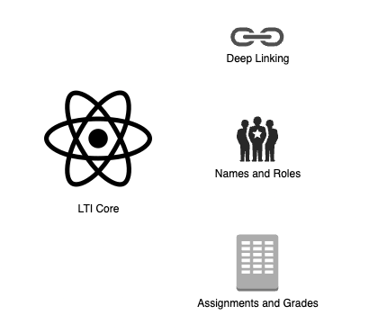

# LTI - Theory

## What is LTI?

LTI (Learning Tools Interoperability) is a standard developed by IMS Global Learning Consortium designed to enable seamless integration of educational tools and platforms. LTI standard allows learning management systems (LMS) or any other platforms to integrate remote tools and content in a standard way without logging into each tool.

LTI allows platforms to host numerous integrations. By using LTI, tools can be developed independently from the platform by different parties.

**This explanation sounds a little bit overwhelming. Can you explain it to me like I am 10?**

Sure! Imagine you go to a school that has its own website where you can find all your lessons, videos, and tests. Every student has their own account, and you can see your scores and progress on this website. This special website is called the Learning Management System or LMS.

Now, think about this: a new, fun quiz game web app has just come out, and your school wants to use it in class. Normally, you would have to go to the quiz game’s website, create a new account, and then log in to play. But wouldn’t it be easier if you could play the quiz game right from your school’s LMS, without making a new account?

That’s exactly what the LTI standard helps with! LTI allows the quiz game to be added to your school’s LMS. This way, you can play the quiz without leaving the LMS and without creating a new account. You just log in to the LMS, and you can access everything you need with one username and password.

## Key concepts

- **Platform**. A *tool platform* or, more simply, *platform* has traditionally been a Learning Management System (LMS), but it may be any kind of platform that needs to delegate bits of functionality out to a suite of *tools*. Examples of platforms are LMS systems such as Coursera, edX, Moodle, Blackboard, and Canvas.
- **Tool**. The external application or service providing functionality to the *platform* is called a *tool*.

<aside>
💡 Historically, LTI referred to platforms as "tool consumers" and tools as "tool providers." However, these terms do not align with their usage in the OAuth2 and OpenID Connect communities. Therefore, LTI 1.3 no longer uses these terms, and instead, it uses "platform" and "tool" to describe the parties involved in an LTI integration.

</aside>

## Example: LTI from the learner's perspective

Let's explore LTI from the learner's perspective.

Firstly, let's introduce the tool. It's a very simple web app with just a few pages: a home page and some resource pages.

On the LMS side, we have lessons, and when a user clicks on the lesson reading link, it launches our LTI tool, which provides the content for Resource 1. This process is called an LTI launch.

The tool's content is embedded within an iframe, so the user doesn't even realize the content is coming from another source. This creates a seamless experience, making it feel like part of the LMS, and the user never leaves the LMS platform. Additionally, the user doesn't need to log in to the tool itself. There are other techniques for integrating an LTI tool, but using an iframe is the most common method.

**The platform acts as the OIDC provider in the LTI process, meaning the tool doesn't need to know anything about the platform’s identity provider. For example, if the platform uses Auth0 for authentication, the tool doesn't need to know anything about Auth0 because the platform issues the ID token, thereby serving as the OIDC provider from the tool's perspective.**

**LTI messages sent from the platform are *OpenID Tokens*. Messages sent from the tool are *JSON Web Tokens* (JWT) as the tool is not typically acting as OpenID Provider.**

## LTI 1.1 vs 1.3

The most popular LTI versions are 1.1 and 1.3. Version 1.1 is deprecated, so this article will focus on the latest version, 1.3, which offers additional capabilities and improvements. Some key benefits of version 1.3 compared to 1.1 include security enhancements:

- LTI 1.1 uses OAuth 1.0, which has been deprecated for years due to insufficient protection. In practice, controlling access to the secret is very difficult.
- LTI 1.3, on the other hand, uses OAuth 2.0 and JWT message signing protocols.
- Additionally, LTI 1.3 adopts the OpenID Connect workflow for authentication with every launch.

You can read about all the benefits of version 1.3 [here](https://brijendrasinghrajput.medium.com/lti-1-3-benefits-over-lti-1-1-a1a37e94bc5b).

## LTI components

The message for embedding content into the platform (LTI launch) is referred to as [LTI Core](https://www.imsglobal.org/spec/lti/v1p3). Additional services are deep linking, names and roles, and assignments and grades. All together are called LTI Advantage.

- [_Deep Linking_](https://www.imsglobal.org/spec/lti-dl/v2p0/): the ability to launch a tool’s configuration panel that will return a configured resource link to the platform based on what the user has set up. The next time a user accesses the link, it will be taken to the configured activity/resource instead of the configuration panel.
- [_Assignment and Grading Services_](https://www.imsglobal.org/spec/lti-ags/v2p0/) (AGS): the ability of posting grades generated by the tool back to the platform’s grade book.
- [_Names and Role Provisioning Services_](http://www.imsglobal.org/spec/lti-nrps/v2p0) (NRPS): the ability of the platform providing the tool with students list and user information.

## Implementation

1. [Creating LTI compatible Tool](https://github.com/ExtensionEngine/lti-tool-example)
2. Creating LTI compatible Platform - TBA
