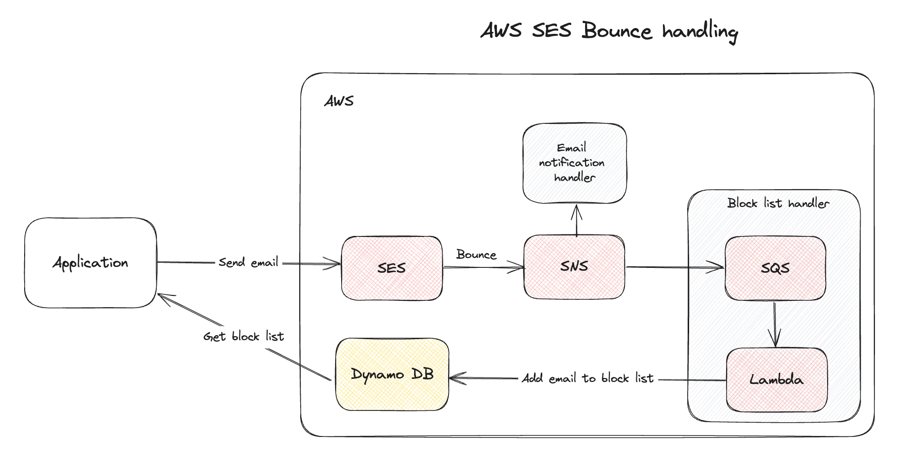
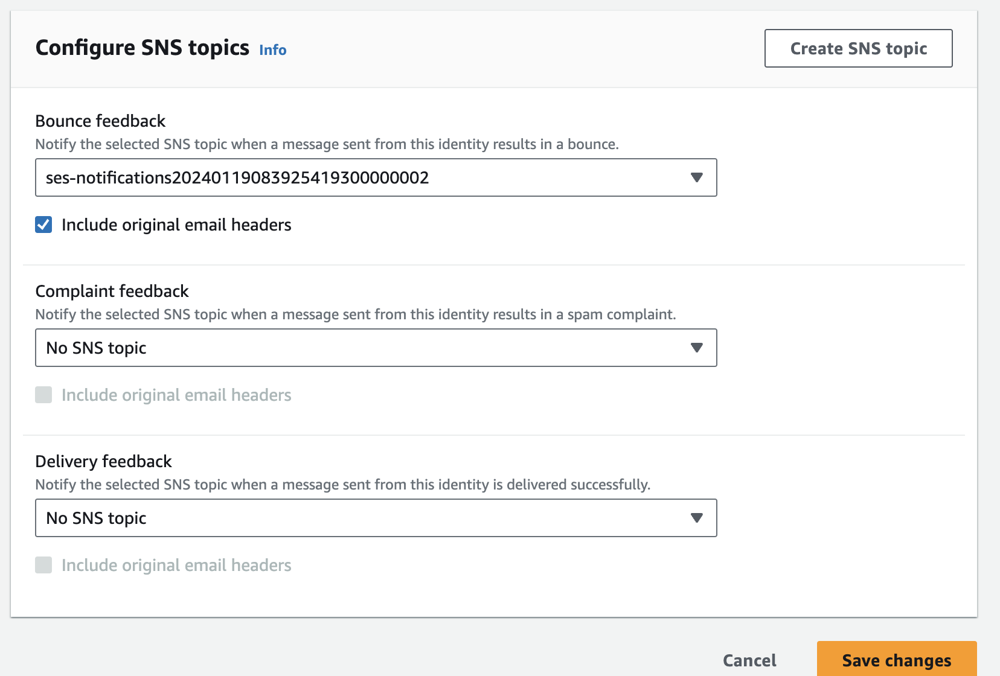
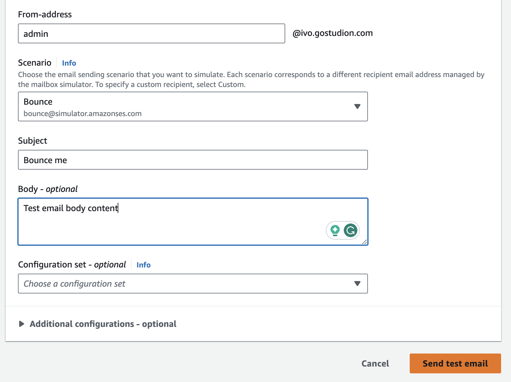

# SES Bounce handling

## Context

Amazon is very strict on rules regarding its email service SES. If you’re having too many bounces or complaints, resulting in a non-healthy sending status, you’ll receive a service block easily.

That's why it's important to handle bounces and complaints accordingly.

**What are bounces and complaints?**

Bounces occur when an email cannot be delivered to the recipient for various reasons. There are two types of bounces: hard bounces and soft bounces.

1. Hard Bounces

   - Hard bounces are caused by permanent issues, such as an invalid email address, a non-existent domain, or the recipient's email server blocking the message.
   - **Impact**: Consistently sending emails to invalid or non-existent addresses can harm your sender reputation. A poor sender reputation may lead to your emails being marked as spam or rejected by email service providers, impacting your overall deliverability.

2. Soft Bounces:

   - Soft bounces result from temporary issues, such as the recipient's mailbox being full or the email server being temporarily unavailable.
   - Unlike hard bounces, soft bounces provide an opportunity to retry delivering the email.

Complaints arise when recipients mark your emails as spam or unwanted. It's important to promptly process this feedback, investigate the reasons for complaints, and take corrective actions, such as removing complaining recipients from your mailing list.

## Building a simple SES bounce handling example

What are we going to build?



We are going to build two bounce handlers - the first one which will send an alert email upon detecting a bounce, and the second one which will add bounced emails to the block list.
The application can subsequently verify whether the recipient's email is listed in the block list. If it is, the system will refrain from sending an email to that address.

You can find the complete working code [here](https://github.com/ikovac/ses-bounce-handling).

We are going to use [Pulumi](https://www.pulumi.com/) to create and manage our infrastructure.

### SNS Topic

Let's start with creating a simple Pulumi program.
We need to create a SNS Topic which is used for receiving SES notification messages.

```typescript
import * as aws from "@pulumi/aws";
import * as pulumi from "@pulumi/pulumi";

export const snsTopic = new aws.sns.Topic("ses-notifications", {
  fifoTopic: false,
  namePrefix: "ses-notifications",
});
```

Once we have created the SNS topic we have to tell SES to use that topic for sending notification messages. To do so, navigate to the AWS Console. Go to the SES service -> Verified identities -> Select your identity -> Notifications tab -> Feedback notifications -> Edit.



Select your newly created SNS topic for bounce feedback and click "Save changes".

### SNS Topic Subscription

Now, with SES notifications routed to the SNS topic, we can proceed to create our initial handler. This handler will be responsible for sending notification emails when bounces occur.

```typescript
const config = new pulumi.Config();

export const subscription = new aws.sns.TopicSubscription(
  "send-email-notification-handler",
  {
    topic: snsTopic.arn,
    protocol: "email-json",
    endpoint: config.require("email"),
    filterPolicyScope: "MessageBody",
    filterPolicy: JSON.stringify({ notificationType: ["Bounce"] }),
  }
);
```

In the code snippet above we created `sns.TopicSubscription` resource that uses `email-json` protocol. Additionally, by defining a `filterPolicy`, we ensure that emails are sent only for messages of the type `Bounce`.
After deploying the current code, you will receive a subscription confirmation email. Please confirm it to start receiving email notifications.

Now we can test our handler by sending a test email.
Navigate to your SES identity page and click the "Send test email" button.



If everything goes as expected you should receive an email notification containing bounce details 🥳.

Although the current handler notifies relevant parties about a bounce, it doesn't take preventive measures for the future. Let's develop a block list handler to address this issue effectively.

### SQS Queue

```typescript
const queue = new aws.sqs.Queue("ses-notifications-queue", {
  fifoQueue: false,
  namePrefix: "ses-notifications-queue",
  sqsManagedSseEnabled: true,
});

const allowSNSToQueueMessages = aws.iam.getPolicyDocumentOutput({
  statements: [
    {
      sid: "AllowSNSToQueueMessages",
      effect: "Allow",
      actions: ["sqs:SendMessage"],
      resources: [queue.arn],
      principals: [
        {
          type: "*",
          identifiers: ["*"],
        },
      ],
      conditions: [
        {
          test: "ArnEquals",
          variable: "aws:SourceArn",
          values: [snsTopic.arn],
        },
      ],
    },
  ],
});

const allowSNSToQueueMessagesPolicy = new aws.sqs.QueuePolicy(
  "allow-sns-to-queue-messages-policy",
  {
    queueUrl: queue.id,
    policy: allowSNSToQueueMessages.apply((policy) => policy.json),
  }
);

const addToBlockListHandler = new aws.sns.TopicSubscription(
  "add-to-block-list-handler",
  {
    topic: snsTopic.arn,
    protocol: "sqs",
    endpoint: queue.arn,
    filterPolicyScope: "MessageBody",
    filterPolicy: JSON.stringify({ notificationType: ["Bounce"] }),
  }
);
```

The code snippet above creates sqs queue and another `sns.TopicSubscription` which forwards bounce messages to our SQS queue.

While it is possible to directly attach a Lambda function to the SNS topic, it is advisable to introduce a queue in between.

The primary advantage of incorporating an SQS (Simple Queue Service) between SNS and Lambda is the ability to reprocess messages. By adding the message to a dead letter queue, we can reprocess it at a later time—something not achievable with direct SNS to Lambda integration.

Another benefit of using SQS is cost efficiency in Lambda invocations. This approach allows for more efficient scaling and reduced costs, as it enables the processing of messages in batches.

In the snippet above we also created the `AllowSNSToQueueMessages` policy which allows SNS to enqueue messages.

⚠ Please take note that, with `notificationType: ["Bounce"] })`, we are currently filtering only Bounce messages for the purpose of this tutorial. However, in real-world scenarios, it is advisable to handle Complaint messages as well. Additionally, it is recommended to distinguish between hard and soft bounces and implement a retry mechanism in the latter case.

### Dynamo DB

Let's proceed by creating a simple DynamoDB table with only an email column, which will be used to store bounced emails.

```typescript
const dynamoTable = new aws.dynamodb.Table("block-list-table", {
  name: "blocklist",
  attributes: [
    {
      name: "email",
      type: "S",
    },
  ],
  hashKey: "email",
  readCapacity: 1,
  writeCapacity: 1,
});
```

### AWS Lambda

Before creating the Lambda function, it's essential to set up the necessary execution role. This role will provide the Lambda function with the required permissions to access DynamoDB and other services such as CloudWatch.

```typescript
const assumeRolePolicy = aws.iam.getPolicyDocument({
  statements: [
    {
      effect: "Allow",
      actions: ["sts:AssumeRole"],
      principals: [
        {
          type: "Service",
          identifiers: ["lambda.amazonaws.com"],
        },
      ],
    },
  ],
});

const iamForLambda = new aws.iam.Role("lambda-execution-role", {
  name: "LambdaExecutionRole",
  assumeRolePolicy: assumeRolePolicy.then((policy) => policy.json),
});

new aws.iam.RolePolicyAttachment("execution-role-policy-attachment", {
  role: iamForLambda.name,
  policyArn:
    "arn:aws:iam::aws:policy/service-role/AWSLambdaSQSQueueExecutionRole",
});

const allowLambdaToAccessDynamoDb = aws.iam.getPolicyDocumentOutput({
  statements: [
    {
      effect: "Allow",
      actions: ["dynamodb:*"],
      resources: [dynamoTable.arn],
    },
  ],
});

const allowLambdaToAccessDynamoDbPolicy = new aws.iam.Policy(
  "allow-lambda-to-access-dynamo-db-policy",
  {
    name: "AllowLambdaToAccessDynamoDb",
    policy: allowLambdaToAccessDynamoDb.apply((policy) => policy.json),
  }
);

new aws.iam.RolePolicyAttachment("lambda-dynamodb-policy-attachment", {
  role: iamForLambda.name,
  policyArn: allowLambdaToAccessDynamoDbPolicy.arn,
});
```

Now we can create our AWS Lambda handler responsible for processing queued messages.

```typescript
const codeZip = new pulumi.asset.AssetArchive({
  "index.mjs": new pulumi.asset.FileAsset("./lambda.mjs"),
});

export const lambda = new aws.lambda.Function("add-to-block-list-lambda", {
  name: "add-to-block-list-handler",
  code: codeZip,
  role: iamForLambda.arn,
  handler: "index.handler",
  runtime: "nodejs20.x",
  environment: {
    variables: {
      TABLE_NAME: dynamoTable.name,
    },
  },
});
```

Lambda code is available in the `lambda.mjs` file.

```javascript
import { DynamoDBClient } from "@aws-sdk/client-dynamodb";
import { DynamoDBDocumentClient, PutCommand } from "@aws-sdk/lib-dynamodb";

const client = new DynamoDBClient({});
const docClient = DynamoDBDocumentClient.from(client);

export const handler = async (event) => {
  const records = event.Records;
  const emails = records.reduce((acc, it) => {
    const body = JSON.parse(it.body);
    const message = JSON.parse(body.Message);
    const bouncedRecipients = message.bounce.bouncedRecipients.map(
      (r) => r.emailAddress
    );
    return [...acc, ...bouncedRecipients];
  }, []);

  const pResult = emails.map((email) => {
    const command = new PutCommand({
      TableName: process.env.TABLE_NAME,
      Item: { email },
    });
    return docClient.send(command);
  });
  await Promise.all(pResult);
};
```

Finally, we can map the SQS queue to our Lambda function:

```typescript
new aws.lambda.EventSourceMapping("sqs-lambda-mapping", {
  eventSourceArn: queue.arn,
  functionName: lambda.arn,
});
```

By sending test email again, we can see that `bounce@simulator.amazonses.com` has been successfully added to the blocklist table 🥳🥳🥳.

You can find the complete working code [here](https://github.com/ikovac/ses-bounce-handling).

## Final words

The purpose of this guide is not to offer a one-size-fits-all solution for every project but rather to present a simple demo handler. This demonstration aims to illustrate that handling bounces and complaints is not that hard.

Before implementing a bounces and complaints handler, it is recommended to investigate the solution that best fits your specific project requirements. For instance, instead of storing bounced emails in DynamoDB, you may opt for an HTTP `sns.TopicSubscription` to notify your system about bounces. Subsequently, you can handle these notifications within your system accordingly.

Additionally, for production use, it is highly advisable to incorporate a dead-letter queue. This ensures the ability to reprocess messages that may have failed.
